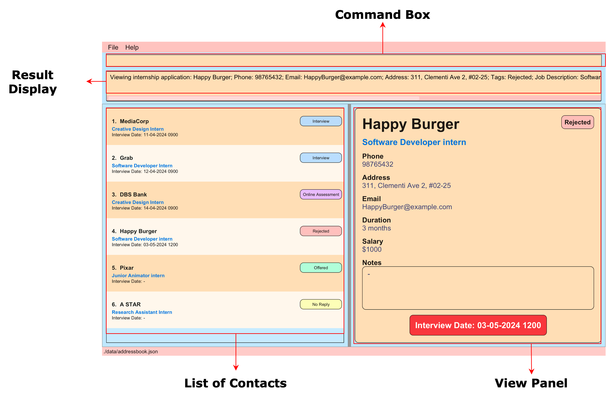
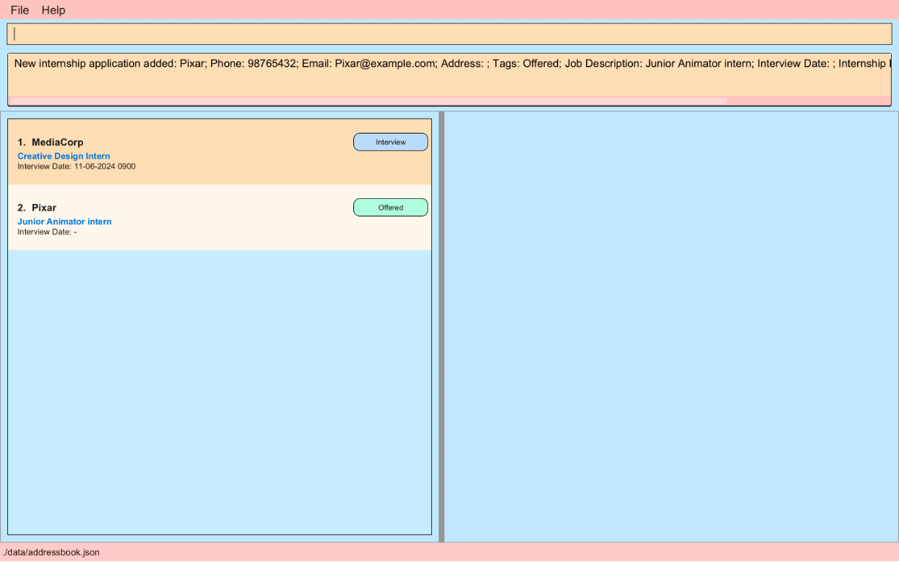
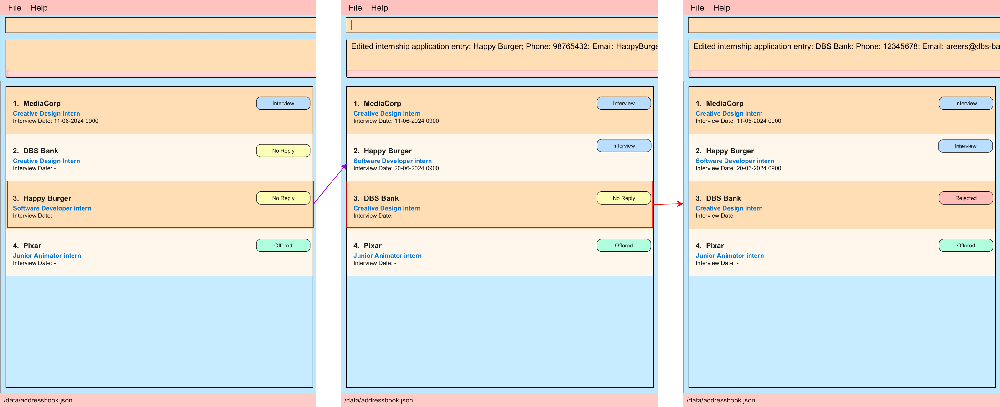
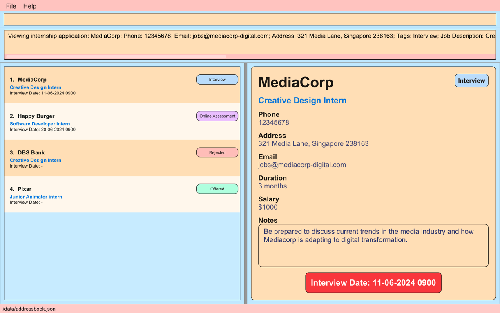
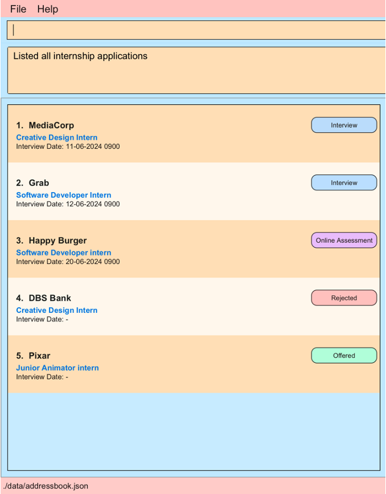
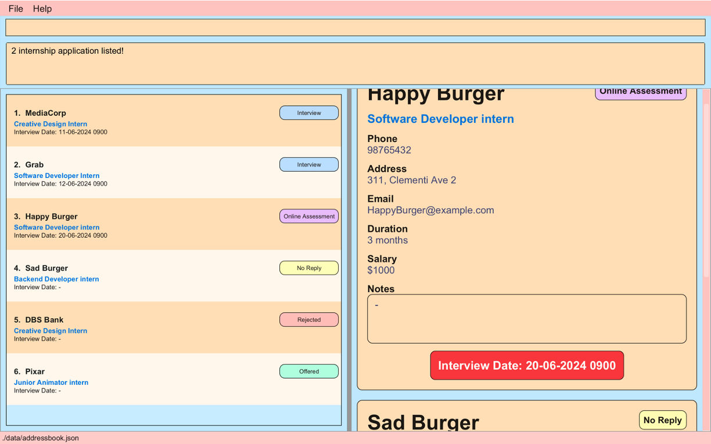
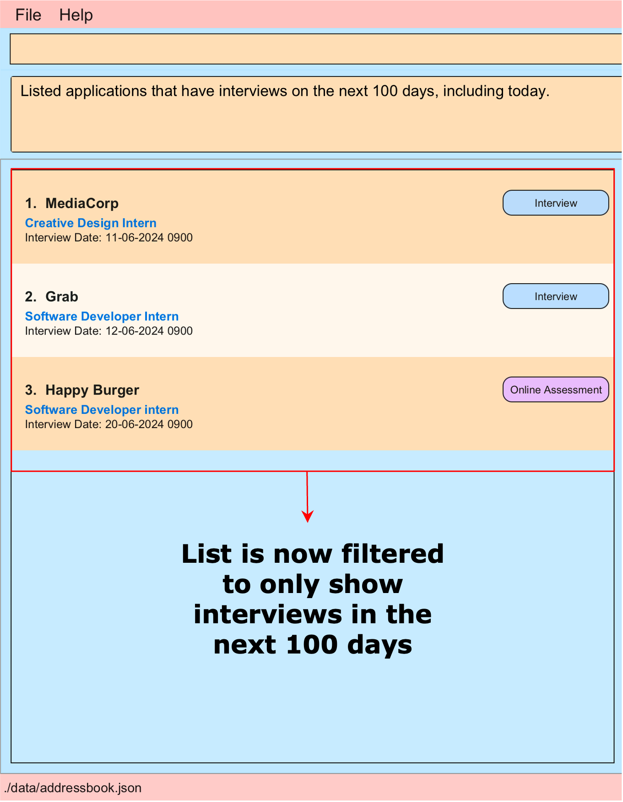

# InternHub User Guide
_By F14-1, JAYME_

# 1. Welcome to InternHub!

Attention, ambitious undergraduates!  
Are you tirelessly navigating the labyrinth of internship opportunities? 
Ever found yourself frustrated by inadvertently applying to the same company twice? 
Losing track of all the different interview dates? 
Amidst the flurry of applications inundating various platforms, it's easy to lose track. 
But fear not – we've got your back.

Introducing InternHub – your ultimate desktop solution for streamlining internship application tracking. 
Bid farewell to the chaos and embrace a seamless journey towards your dream internship. 

## 1.1 Who can benefit from InternHub?

InternHub caters to **undergraduates from all fields**, providing them with a seamless and efficient approach to managing their internship contacts.
**For professors and career guidance officers** reading this, we invite you to share this invaluable resource with your students, empowering them to secure their dream internships.

InternHub is meticulously crafted with **user-friendliness** at its core, tailored to accommodate individuals of all computer proficiency levels. 
Whether you're a seasoned tech enthusiast or just starting to explore desktop applications, our interface ensures a seamless experience, intuitively guiding you through every step of your internship management journey. 
With InternHub's sleek Command Line Interface (CLI), navigation and management become effortless, empowering you to stay focused on your goals.

Unlock the power to focus on what truly matters – securing that coveted internship – with InternHub by your side.

## 1.2 Skipping Ahead?

For users who are **new to InternHub**, click [here](#2-quick-start) for a helpful starting point!

Experienced users can jump straight to exploring our [features](#4-features)!

--------------------------------------------------------------------------------------------------------------------
<page-nav-print />

<!--
# Table of Contents 
- [Introduction](#introduction-to-the-user-guide)
- [Quick Start](#quick-start)
- [Getting Familiar with UI](#getting-familiar-with-the-ui-of-internhub)
- [Features](#features)
    - [Basic Commands](#basic-commands)
        - [Adding a Contact](#adding-a-contact-add)
        - [Deleting a Contact](#deleting-a-contact-delete)
        - [Editing a Contact](#editing-a-contact-edit)
        - [Viewing a Contact](#viewing-a-contact-view)
    - [Advanced Commands](#advanced-commands)
        - [Listing all Contacts](#listing-all-contacts-list)
        - [Locating Contacts by Name](#locating-contacts-by-name-find)
        - [Updating a Note](#updating-a-note-note)
        - [Filter Contacts by Tags](#filter-by-tag-filter)
        - [Getting Reminders](#getting-reminders-reminder)
    - [Miscellaneous Commands](#miscellaneous-commands)
        - [Help](#viewing-help-help)
        - [Clearing all Entries](#clearing-all-entries-clear)
        - [Exiting the Program](#exiting-the-program-exit)
    - [Storage & Data](#storage-and-amp-data)
        - [Saving the Data](#saving-the-data)
        - [Editing the Data](#editing-the-data-file)
- [FAQ](#faq)
- [Known Issues](#known-issues)
- [Command Summary](#command-summary)
- [Glossary](#glossary)

jawad i am not removing ur beautiful work of art, i just testing how it looks without it first ok <3
-->

--------------------------------------------------------------------------------------------------------------------

# 2. Quick Start

1. Check Java Version & Install Java
    - For this application, your system is required to have Java 11 installed
    - To check if you have Java installed, open your command prompt or terminal and type : `java -version`
        - If Java is installed, you will see the version number in the output :
        - 
    - If Java is not installed or your version does not match as the output above :
        - Visit the Official [Oracle website](https://www.oracle.com/java/technologies/downloads/#java11) to download jdk-11 & follow the download instructions
        - For **mac** users, download the jdk-11 from [here](https://www.azul.com/downloads/?version=java-11-lts&os=macos&architecture=arm-64-bit&package=jdk-fx#zulu)

2. Download the latest `internhub.jar` from [here](https://github.com/AY2324S2-CS2103T-F14-1/tp/releases).

3. Copy the file to the folder you want to use as the _home folder_ for your InternHub.
    - The home folder will serve as InternHub's central location
    - This folder is where InternHub will keep all its important files and saved data

4. Once you have set up the _home folder_, right-click on the _home folder_ and click copy to copy the path to this directory.

5. Open up a new terminal or command prompt window

6. Type `cd ` and paste the _home folder_ path, your command should look something like this : `cd /Users/john/home folder`, then hit enter.

7. Now in the same command prompt or terminal window, enter the `java -jar internhub.jar` command to run the application. 
   A GUI similar to the below should appear in a few seconds. Note how the app contains some sample data. 
   

8. Type the command in the command box and press Enter to execute it. e.g. typing **`help`** and pressing Enter will open the help window. 
 
9. Refer to the [Features](#features) for a full detailed list of each command.

--------------------------------------------------------------------------------------------------------------------
# 3. Product Overview

Our team has carefully designed this user guide to be your one-stop solution for everything related to InternHub! 
Our aim is to help you get started with InternHub as quickly as possible. 
The guide features all the available commands, their syntax, as well as specific examples for illustration.

Here in this section, we will be explaining the icons used and providing clear guidance on UI navigation. 
Furthermore, we are providing guidelines for command formatting and contact details in InternHub, along with an understanding of each parameter.

## 3.1 Icons used

<box type="info" >Additional useful information</box>
<box type="warning" >Provides warnings on some potential errors</box>
<box type="tip" >Nifty tricks to make your experience smoother</box>

## 3.2 Understanding InternHub's User Interface

[//]: # (![Ui]&#40;images/UserGuide/GUI_annotation.png&#41;)

**Command Box**
- Enter your commands in this box.

**Result Display**
- View the output message after each command here. 
- For longer commands like `Add`, the output text may get cut off, simply use our pink scroll bar to view the entire output.

**List of Contacts**
- This panel displays a list of all internship company contacts.

**View Panel**
- The contact details card of the selected internship company is displayed in this panel.

## 3.3 Command and Formatting Guidelines

1. **Parameters in `UPPER_CASE` are user-supplied.** 
  For example, in `add c/COMPANY_NAME`, replace `COMPANY_NAME` with the actual company name like `add c/Food Panda`.

2. **Square brackets denote optional items.**  
  For instance, `c/COMPANY_NAME [a/ADDRESS]` can be entered as `c/Food Panda a/CBD` or simply `c/Food Panda`.

3. **Parameters can be in any order.**  
  For example, if a command specifies `add c/COMPANY_NAME p/PHONE_NUMBER`, `p/PHONE_NUMBER add c/COMPANY_NAME` is also valid.

4. **Unnecessary parameters for commands without specified inputs (e.g., `help`, `list`, `exit`, and `clear`) are ignored.**  
  For instance, `help 123` will be treated as `help`.

5. **Refrain from copying command lines from the User Guide**  
  When copying and pasting multi-line commands from a PDF, be cautious as space characters around line breaks might be omitted.

## 3.4 Understanding Each Parameter

| Parameter | Description         | Constraints                                                                                         | Example                          | Required |
|-----------|---------------------|-----------------------------------------------------------------------------------------------------|----------------------------------|----------|
| `c/`      | Company Name        | Only contain alphanumeric values                                                                    | `c/ABC Corporation`              | Yes      |
| `p/`      | Phone Number        | Only contain numbers and at least 3 digits                                                          | `p/98765432`                     | Yes      |
| `e/`      | Email Address       | Should be of the format local-part@domain, multiple consecutive special characters are not allowed. | `e/example@example.com`          | Yes      |
| `t/`      | Tags                | Valid values are NR, I, O, OA, R                                                                    | `t/NR`                           | Yes      |
| `jd/`     | Job Description     | -                                                                                                   | `jd/Software Developer Intern`   | Yes      |
| `id/`     | Internship Duration | -                                                                                                   | `id/3 months`                    | Yes      |
| `s/`      | Salary              | Only positive numbers                                                                               | `s/500`                          | Yes      |
| `a/`      | Physical Address    | -                                                                                                   | `a/123 Main St, City, Country`   | No       |
| `d/`      | Interview Date      | Of format dd-mm-yyyy HHmm & cannot be earlier than current day                                      | `d/14-04-2024 1500`              | No       |
| `n/`      | Notes               | -                                                                                                   | `n/Previous experience required` | No       |

### 3.4.1 Company Name

For company names with **special characters**, it's advisable to omit them or replace them with spaces.

Here are some examples:
- "7-Eleven" can be inputted as "7 Eleven" instead.
- "ABC PTE LTD." can be inputted as "ABC PTE LTD" or "ABC Private Limited."
- "ABC Co., Ltd" can be inputted as "ABC Co LTD" or "ABC Company Limited."

**Please note that company names are case-sensitive.**
  This means variations in capitalization, such as "Apple" and "apple," will be treated as separate entries.

<box type="tip">
To maintain data consistency and accuracy, we encourage users to adhere to the correct capitalization when entering company names.
This helps prevent unintentional duplication and ensures each company is uniquely identified within the system.
  For example, if you've entered a company name as "Apple," ensure you consistently use the same capitalization in future entries related to that company.
</box>

### 3.4.2 Phone Number

In InternHub, we aim to provide flexibility to users without imposing overly strict restrictions.
  Therefore, we **allow duplicate phone numbers** to be entered for different contacts.

### 3.4.3 Email

For emails with special characters, **multiple consecutive special characters are not allowed**.
  Here's an example of a valid email: `abc+company@example.com`.
  An invalid email example would be `abc+_company@example.com`.

### 3.4.4 Tags

Ensure to include the appropriate tag after `t/` to denote the status of the internship application:

- **NR (No Reply):** Indicates no response from the company regarding the internship application.
- **I (Interview):** Signifies an interview scheduled for the internship with the company.
- **O (Offered):** Indicates receipt of an internship offer from the company.
- **OA (Online Assessment):** Denotes requirement of an online assessment or test.
- **R (Rejected):** Indicates rejection of the internship application by the company.

When using tags to denote the status of internship applications, ensure you use **UPPERCASE** for the tags.
  Incorrect usage may result in misinterpretation of the application status.
  For example, the correct format is `t/I`.

### 3.4.5 Internship Duration

We have intentionally omitted setting a minimum internship duration as there isn't a universally fixed minimum duration for internships.

### 3.4.6 Internship Date

1. **Invalid Date**  
  When InternHub encounters an invalid date like "29-02-2031," which doesn't exist because 2031 isn't a leap year, it automatically changes it to the closest valid date, which is "28-02-2031." 
  This happens because the InternHub follows the rules of the Gregorian calendar, which determines how dates are calculated and adjusted.

2. **Overlapping of interview dates and time**  
  In InternHub, it's possible to schedule interviews with multiple companies for the same date and time. 
  This flexibility acknowledges that you may have multiple interviews lined up simultaneously, requiring you to choose between them based on your preferences and priorities.

3. **Using JSON file to change the date**  
  While we've ensured that when adding or editing an internship application, the interview date cannot precede the current day, we also recognize the importance of allowing deliberate adjustments to past dates. 
  As a result, experienced users have the flexibility to edit interview dates in the JSON file, empowering them to rectify errors and make necessary modifications.

4. **Error messages** 
  When entering the command 'edit 3 d/14-07-2024 3", InternHub will display two error messages:
  _Interview Date & Time needs to follow this pattern : dd-mm-yyyy HHmm_
  _Interview Date & Time cannot be before today's date !_

<box type="tip" >

Please only read the error message that is relevant to your situation. In this case, it is the first line.

</box>

## 3.5 Understanding Contact Identification in InternHub

Each contact is uniquely identified by the combination of **Company Name** and **Job Description**
- You **can** have more than 1 internship application with the same company name but **different** job descriptions
  InternHub allows users to have more than one entry associated with the same company name, as long as each entry has a different job description. This flexibility accommodates scenarios where individuals may apply to different positions within the same company.
- You **cannot** have more than 1 contact with the same company name **and** same job description.
    This restriction ensures data accuracy and prevents duplication of contacts with identical roles within the same company.

<box type="tip" >

1. Example of Allowed Internship Applications:
    Internship application 1: Company Name - ABC Corp, Job Description - Software Engineer
    Internship application 2: Company Name - ABC Corp, Job Description - Marketing Specialist

2. Example of Not Allowed Input:
    Internship application 1: Company Name - ABC Corp, Job Description - Software Engineer
    Internship application 2: Company Name - ABC Corp, Job Description - Software Engineer

  </box>

--------------------------------------------------------------------------------------------------------------------
# 4. Features

## 4.1 Basic Commands

### 4.1.1 Adding a contact: `add`

Add a new internship company contact into InternHub.

<box>

**Format:** `add c/COMPANY_NAME p/PHONE_NUMBER e/EMAIL t/TAG jd/JOB_DESCRIPTION id/INTERN_DURATION s/SALARY [a/ADDRESS] [d/INTERVIEW_DATE] [n/NOTE]`

</box>

<box type="warning">

All fields are unable to handle multiple inputs.

Example of correct format: `add c/Happy Burger p/98765432 e/HappyBurger@example.com a/311, Clementi Ave 2, #02-25 t/I jd/Software Developer intern d/29-05-2024 1200 id/3 months s/1000 n/Company CEO is John Doe`
  This internship application will be added in InternHub successfully.

Example of incorrect format: `add c/Happy Burger p/98765432 e/HappyBurger@example.com a/311, Clementi Ave 2, #02-25 t/I jd/Software Developer intern d/29-05-2024 1200 id/3 months s/1000 n/Company CEO is John Doe `**`n/Company has 500 employee`**
  An error message _"Multiple values specified for the following single-valued field(s): n/"_ will be shown on the result display box. 

</box>

**Example 1:**

- This example represents an application for a Creative Design Internship position at MediaCorp.
- The tag t/I indicates that **an interview has been scheduled** with the company.
- The notes section provides additional information about Mediacorp and suggests topics for discussion during the interview.

We have provided the command below with all parameters provided, including the optional parameters:

`
add c/MediaCorp p/12345678 e/jobs@mediacorp-digital.com a/321 Media Lane, Singapore 238163 t/I jd/Creative Design Intern d/11-06-2024 0900 id/3 months s/1000 n/Be prepared to discuss current trends in the media industry and how Mediacorp is adapting to digital transformation.
`

**Expected Outcome**

**Example 2:**

- This example represents an application for a Junior Animator Internship position at Pixar.
- The tag t/O indicates that an **offer has been received** from the company.
- Optional parameters such as the address, interview date, and notes are omitted, demonstrating that their absence does not impact the completeness of this command.

We have provided the command below with only the necessary parameters provided, excluding the optional parameters:

`add c/Pixar p/98765432 e/Pixar@example.com t/O jd/Junior Animator intern id/3 months s/1000`

**Expected Outcome**

**More examples for you to try out:**
- `add c/Grab p/66550000 e/careers@grab.com a/6 Temasek Boulevard t/I jd/Software Developer Intern d/12-06-2024 0900 id/6 months s/1500 n/Grab offers various services like ride-sharing, food delivery and etc.`

- `add c/Happy Burger p/98765432 e/HappyBurger@example.com a/311, Clementi Ave 2 t/NR jd/Software Developer 
intern id/3 months s/1000`

- `add c/DBS Bank p/12345678 e/areers@dbs-bank-online.com a/321 Media Lane, Singapore t/NR jd/Creative Design 
Intern id/3 months s/1000`

### 4.1.2 Deleting a contact : `delete`

Deletes an internship company contact by index from InternHub.

<box>

**Format:** `delete INDEX`

</box>

* Deletes the contact at the specified `INDEX`.
* The index refers to the index number shown in the displayed contact list.
* The index **must be a positive integer** 1, 2, 3, …​

**Example 1:**

`list` followed by `delete 2` deletes the 2nd contact.

**Expected outcome**

After we execute the delete command, the Grab entry is no longer in our list of contacts.

### 4.1.3  Editing a contact : `edit`

Edits an existing internship company contact detail in InternHub.

1. Begin by typing `edit`, followed by the `INDEX` of the application. The index refers to the index number shown in the displayed contact list.
2. Next, include only specific prefix for the fields of the contact you wish to edit in your records. 
   **At least one** of the optional fields must be provided and at most one of each field can be provided.
3. After pressing enter, existing values will be updated to the input values.

<box>

**Format:** `Edit INDEX [c/COMPANY_NAME] [p/PHONE_NUMBER] [e/EMAIL] [t/TAG] [jd/JOB_DESCRIPTION] [id/INTERN_DURATION] [s/SALARY] [a/ADDRESS] [d/INTERVIEW_DATE] [n/NOTE]`

</box>

<box type="warning">

When you edit any field with a new value, this will **OVERWRITE** the old value!

</box>

<box type="tip">

If you want to delete any of the **Optional** fields, you can use edit like so:
- `edit 2 d/` will remove the **interview date** of company at index 2.
- `edit 2 a/` will remove the **address** of company at index 2.
- `edit 2 n/` will remove the **note** of company at index 2.

</box>

<box type="warning">

All fields are unable to handle multiple inputs.

Example of correct format: `edit 1 n/Company CEO is John Doe`
  We update the 1st internship application's note.

Example of incorrect format: `edit 1 n/Company CEO is John Doe n/Company has 500 employee`
  An error message _"Multiple values specified for the following single-valued field(s): n/"_ will be shown on the result display box.

</box>

**Example 1**
- We've received confirmation of an online assessment from a previously unresponsive company, Happy Burger.
- We want to do the following:
  - Change the status from "NR" to "OA"
  - Set the online assessment date for Happy Burger to be 20 June 2024 at 9 am.

With the edit command, we can achieve this with the following command: 

`edit 3 t/OA d/20-06-2024 0900`

**Example 2**
- Unfortunately, we've received a rejection email from DBS Bank.
- We want to do the following:
    - Change the status from "NR" to "R"

With the edit command, we can achieve this with the following command:

`edit 3 t/R`

The image below shows the respective outcomes after executing both edit commands: 

<box type="info">

Notice how when we set the online assessment date for DBS, the contact list dynamically rearranged to prioritize the latest interview at the top.
  This dynamic sorting is based on the first interview date.

</box>

### 4.1.4 Viewing a contact : `view`

Views the details of the internship company contact on the view panel in InternHub.

<box>

**Format:** `view INDEX`

</box>

* Views the contact at the specified `INDEX`. 
* The index refers to the index number shown in the displayed contact list. 
* The index **must be a positive integer** 1, 2, 3, …​

**Example:**

*  `view 1` Displays the company card of the 1st contact in the list on the view panel.

--------------------------------------------------------------------------------------------------------------------

## 4.2  Advanced Commands

### 4.2.1 Listing all contacts : `list`

This command shows a list of all internship application contacts in InternHub sorted in ascending order of interview dates.
Internship application contacts with interview dates will be listed first, followed by internship application contacts without interview dates.

<box>

**Format:** `list`

</box>

**Expected Outcome**

All internship application contacts will be shown on the left side of the window.

{ width=60% }

### 4.2.2 Locating contacts by name: `find`

Finds contacts whose company names contain any of the given keywords.

<box>

**Format:** `find KEYWORD [MORE_KEYWORDS]`

</box>

* All matching results of the find will be displayed in your view panel. 
* The search is case-insensitive. e.g `shoppa` will match `Shoppa`.
* The order of the keywords does not matter. e.g. `Food Panda` will match `Panda Food`.
* Only the name is searched.
* Only full words will be matched e.g. `Shopp` will not match `Shoppa`, `Food Panda` will not match `FoodPanda`.
* Contacts matching at least one keyword will be returned (i.e. `OR` search).
  e.g. `Happy Burger` will return `Happy Meal`, `Burger Queen`.

Examples:
* `find burger` returns `Happy Burger` and `Sad Burger` .
  

### 4.2.3 Updating a Note : `note`

This command will allow you to update the notes of a company contact without overwriting them.

<box>

**Format:** `note INDEX`

</box>

Updating a note of an **existing company contact**
- Suppose you want to edit the note of company contact at index **2**
- Use the note command as follows: `note 2`
  

- When you hit enter, it will retrieve the note content of the company contact at index 2 in the command box **as an edit command**:
  

- Simply update the note content and hit enter again:
  

- The next time you view the contact, the note section will be updated:
  

### 4.2.4 Filter By Tag : `filter`

Filtering data allows you to narrow down your search results to focus on internship contacts based on their status. 
Use the `filter` command to filter by tag and find exactly the internships that have an interview.

<box>

**Format:** `filter VALID TAG`

</box>

<box type="info">

Valid Tag Inputs   
- NR: No Reply
- I: Interview
- O: Offered
- OA: Online Assessment
- R: Rejected

</box>

**Example:**

- `filter i` or `filter I`
- Filters the contact list to display only internship company contacts with an Interview status

{ width=60% }

### 4.2.5 Getting reminders : `reminder`

Sending reminders is a pivotal practice to uphold organization and ensure timely completion of crucial tasks. 
Although our application presently lacks a built-in reminder feature, fear not! 

You can effortlessly retrieve reminders manually using this command. 
It conveniently displays the interviews scheduled within the upcoming N days, keeping you well-prepared and on track.

<box>

**Format:** `reminder INT`

</box>

**Examples:**
- `reminder 0` : Shows you the interviews you have today.
- `reminder 2` : Shows you the interviews you have in the next two days, including today.
- `reminder 100` : Shows you the interviews you have in the next hundredth days, including today.

{ width=60% }

<box type="tip"> 
This is a quick and easy way to be reminded of the upcoming interviews in order to not miss them.
</box>

--------------------------------------------------------------------------------------------------------------------

## 4.3 Miscellaneous Commands

### 4.3.1 Getting help : `help`

To access our InternHub User Guide at anytime, simply type help into the command box and press Enter.
This action will display a link to this document, allowing you to easily navigate and explore the comprehensive features of InternHub.

<box>

**Format:** `help`

</box>

<box type="tip"> 

You can also execute this command by using the `F1` key on your keyboard.

</box>

**Expected Outcome**

A separate help window will appear.

### 4.3.2 Clearing all entries : `clear`

Clears all entries stored in InternHub.

<box>

**Format:** `clear`

</box>

### 4.3.3 Exiting the program : `exit`

Exits the program.

<box>

**Format:** `exit`

</box>

--------------------------------------------------------------------------------------------------------------------

## 4.4 Storage & Data

### 4.4.1 Saving the data

InternHub data are saved in the hard disk automatically after any command that changes the data. There is no need to save manually.

### 4.4.2 Editing the data file

InternHub data are saved automatically as a JSON file `[JAR file location]/data/addressbook.json`. Advanced users are welcome to update data directly by editing that data file.

<box type="warning">

**Caution:**
If your changes to the data file makes its format invalid, InternHub will discard all data and start with an empty data file at the next run.  Hence, it is recommended to take a backup of the file before editing it. 
Furthermore, certain edits can cause the InternHub to behave in unexpected ways (e.g., if a value entered is outside the acceptable range). Therefore, edit the data file only if you are confident that you can update it correctly.

</box>

--------------------------------------------------------------------------------------------------------------------
# 5. FAQ

**Q**: How do I transfer my data to another Computer? 
**A**: Install the InternHub app on the other computer and replace the empty data file it creates with the file containing the data from your previous InternHub *home folder*.

**Q**: What is a home folder? 
**A**: A home folder is the main directory associated with a user account on a computer. It typically contains user-specific settings, documents, downloads, and their personal files. Here is an example using the user name "internGuy" on a Unix-like system: `/home/internGuy`. On a Windows sytem, `C:\users\internGuy`.

**Q**: Why is the app not running? 
**A**: Ensure that JDK `11` or above is installed.

**Q**: Does the user know how to open the command terminal/how to change directory (cd) into a folder? 
**A**: Users should refer to the documentation or help resources specific to their operating system for instructions on opening a command terminal and navigating to a directory using the `cd` command.

**Q**: How do I run internhub.jar? 
**A**: You can run internhub.jar by opening a command terminal, navigating to the directory containing the jar file using the `cd` command, and then typing `java -jar internhub.jar` and pressing Enter.

--------------------------------------------------------------------------------------------------------------------

# 6. Known Issues

1. **When using multiple screens**, if you move the application to a secondary screen, and later switch to using only the primary screen, the GUI will open off-screen. The remedy is to delete the `preferences.json` file created by the application before running the application again.

2. **When entering numbers greater than 2147483647 (maximum Integer value)** for commands e.g. reminder 100000000000, the input will be considered invalid as we assumed that most users will not encounter this issue in normal usage. A solution could be added in a future iteration. 

3. **Inconsistent UI tag colour**, currently InternHub permits users to input tags in lowercase, resulting in unfilled tag colors. For our future implementation, we intend to either display a warning to users when they use lowercase instead of uppercase for tags, or automatically convert the tag value to uppercase.

4. **Company name is case-sensitive**, this make it possible for user to input "Apple" and "apple" in our application. It is possible that both input refer to the same company and may lead to potential confusion. For our future implementation, we intend to make company name case-insensitive.

5. **Phone numbers allow duplicates**: We did not want to set high restrictions in our application, hence did not force users to ensure all phone numbers must be unique. From user feedback, duplicate phone numbers can lead to potential confusion, especially when managing large contact lists. A solution could be added in a future iteration.

--------------------------------------------------------------------------------------------------------------------

# 7. Command Summary

| Action       | Format, Examples                                                                                                                                                                                                                                                        |
|--------------|-------------------------------------------------------------------------------------------------------------------------------------------------------------------------------------------------------------------------------------------------------------------------|
| **Add**      | `add c/COMPANY_NAME p/PHONE_NUMBER e/EMAIL a/[ADDRESS] t/TAG jd/JOB_DESCRIPTION d/[INTERVIEW_DATE] id/INTERN_DURATION s/SALARY n/[NOTE]`   e.g., `add c/FoodPanda p/12345678 e/panda@food.com a/CBD t/I jd/Front End Intern d/15-04-2024 0900 id/6 months s/500 n/-` |
| **Delete**   | `delete INDEX` e.g., `delete 3`                                                                                                                                                                                                                                         |
| **Edit**     | `Edit INDEX c/[COMPANY_NAME] p/[PHONE_NUMBER] e/[EMAIL] a/[ADDRESS] t/[TAG] jd/[JOB_DESCRIPTION] d/[INTERVIEW_DATE] id/[INTERN_DURATION] s/[SALARY] n/[NOTE]`  e.g.,`Edit 2 p/99987654`                                                                              |
| **View**     | `view INDEX` e.g., `view 3`                                                                                                                                                                                                                                             |
| **List**     | `list`                                                                                                                                                                                                                                                                  |
| **Find**     | `find KEYWORD [MORE_KEYWORDS]`e.g., `find foodpanda`                                                                                                                                                                                                                    |
| **Note**     | `note INDEX`                                                                                                                                                                                                                                                            |
| **Filter**   | `filter VALID _TAG` e.g., `filter I`                                                                                                                                                                                                                                    |
| **Reminder** | `reminder INT`                                                                                                                                                                                                                                                          |
| **Help**     | `help`                                                                                                                                                                                                                                                                  |
| **Clear**    | `clear`                                                                                                                                                                                                                                                                 |
| **Exit**     | `exit`                                                                                                                                                                                                                                                                  |

--------------------------------------------------------------------------------------------------------------------

# 8. Glossary

| Term                              | Meaning                                                                                                                                                                 |
|-----------------------------------|-------------------------------------------------------------------------------------------------------------------------------------------------------------------------|
| Java Version                      | A programming language and computing platform used for the InternHub application. Version 11 or higher is required for proper functioning.                              |
| Terminal or Command Prompt        | Command-line interfaces used to interact with the operating system and run commands.                                                                                    |
| Result Display                    | Area where outputs and messages from InternHub are displayed.                                                                                                           |
| View Panel                        | Area displaying detailed information of the selected internship company contact.                                                                                        |
| Features                          | Functionalities provided by InternHub, including adding, editing, deleting, and filtering contacts                                                                      |
| Command                           | A directive given to the program to perform a specific task                                                                                                             |
| GUI (Graphical User Interface)    | A visual way of interacting with a computer through graphical elements like windows, icons, buttons & menus                                                             |
| Index                             | A numerical identifier used to specify the position of an item in a list, for this context the position of an internship company contact                                |
| JSON (JavaScript Object Notation) | A lightweight data interchange format that is easy to read & write, and for machines to parse. InternHub uses JSON to store and manage data                             |
| CLI (Command Line Interface)      | A way to interact with a computer by typing commands into a terminal or command box                                                                                     |
| Prefix                            | A string of characters placed at the beginning of a command to indicate its type. For example, InternHub uses `c/` for company name and `p/` for phone number and so on |
| Field                             | A specific piece of information within each internship company contact like company name, phone number & etc...                                                         |

