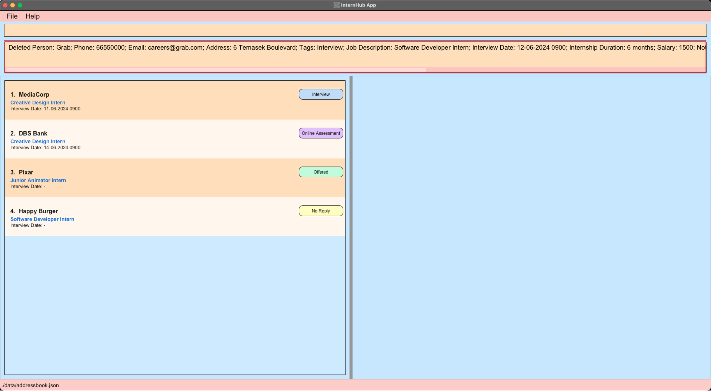
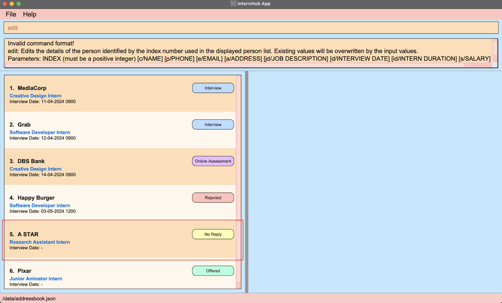
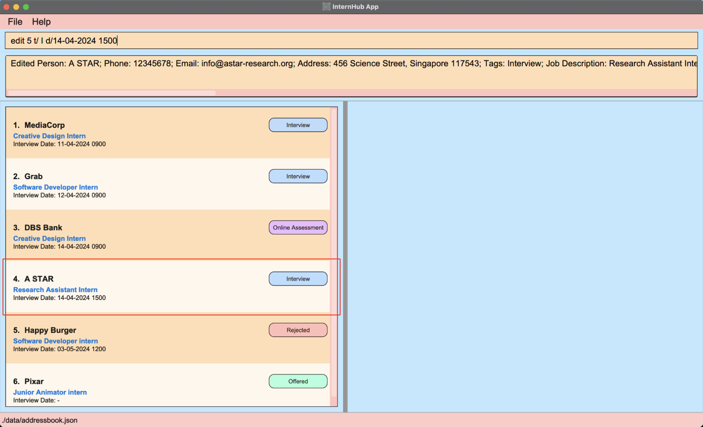
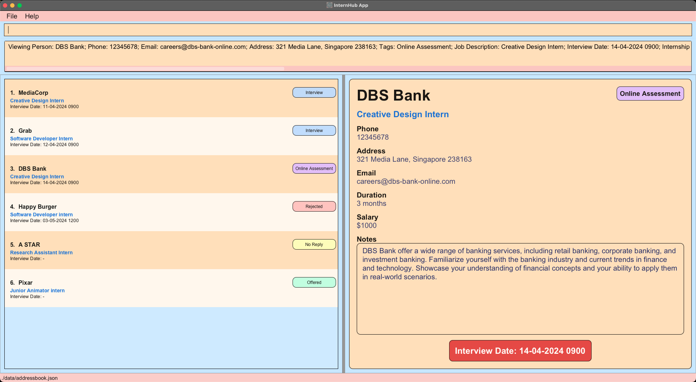
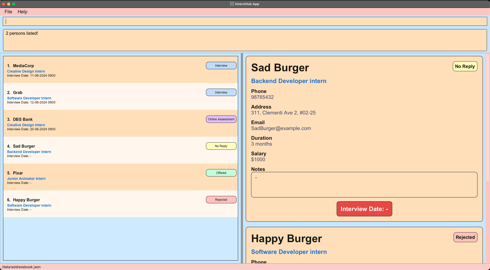
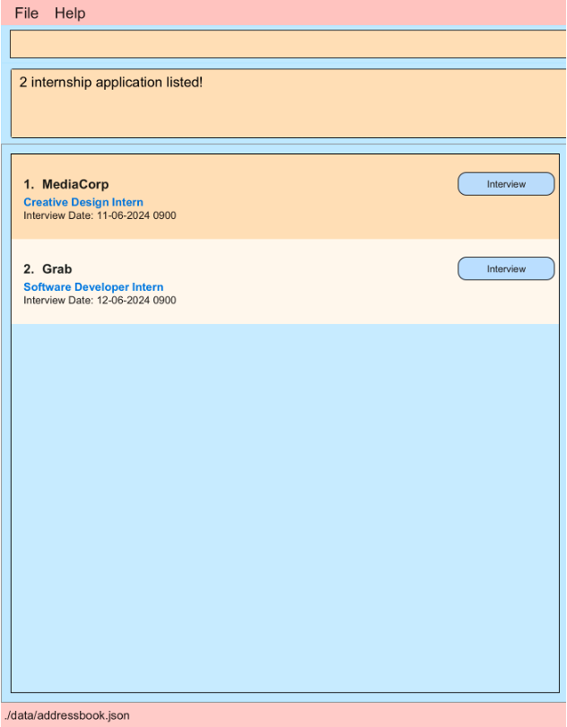

# Internhub User Guide

## Welcome !
Are you currently navigating the intricate maze of internship opportunities as an undergraduate? 
Your search ends here! InternHub is poised to transform the way you handle your internship contacts.
InternHub stands as a beacon of productivity, offering you a comprehensive platform to manage and organize all your internship applications effectively.

This User Guide (UG) acts as your trusted companion, providing a wealth of information to assist you in understanding and harnessing the full potential of our application. 
From installation to usage and navigation, each step is meticulously outlined to ensure you derive maximum benefits from InternHub in managing your internship contacts.

## Who can use InternHub ?
InternHub caters to undergraduates from all fields, providing them with a seamless and efficient approach to managing their internship contacts. 
Professors and career guidance officers, we invite you to share this invaluable resource with your students, empowering them to secure their dream internships.

InternHub is designed with **user-friendliness** in mind, catering to individuals with varying levels of computer experience. 
Whether you're a tech-savvy enthusiast or just dipping your toes into the world of desktop applications, rest assured that our interface is intuitive and easy to navigate.
We're committed to supporting you every step of the way on your internship management journey. 

Welcome aboard, and let's embark on this exciting adventure together!

For users who are **new to InternHub**, click [here](#introduction-to-the-user-guide) for a helpful starting point !

Experienced users can jump straight to exploring our [features](#features) !

--------------------------------------------------------------------------------------------------------------------

## Table of Contents
- [Introduction](#introduction-to-the-user-guide)
- [Quick Start](#quick-start)
- [Getting Familiar with UI](#getting-familiar-with-the-ui-of-internhub)
- [Features](#features)
    - [Help](#viewing-help-help)
    - [Basic Commands](#basic-commands)
        - [Adding a Contact](#adding-a-contact-add)
        - [Deleting a Contact](#deleting-a-contact-delete)
        - [Editing a Contact](#editing-a-contact-edit)
        - [Viewing a Contact](#viewing-a-contact-view)
    - [Advanced Commands](#advanced-commands)
        - [Listing all Contacts](#listing-all-contacts-list)
        - [Locating Contacts by Name](#locating-contacts-by-name-find)
        - [Adding a Note](#adding-a-note-note)
        - [Filter Contacts by Tags](#filtering-the-data-by-tags-filter)
        - [Sending Reminders](#sending-reminders-reminder)
    - [Miscellaneous Commands](#miscellaneous-commands)
        - [Clearing all Entries](#clearing-all-entries-clear)
        - [Exiting the Program](#exiting-the-program-exit)
    - [Storage & Data](#storage-and-amp-data)
        - [Saving the Data](#saving-the-data)
        - [Editing the Data](#editing-the-data-file)
- [FAQ](#faq)
- [Known Issues](#known-issues)
- [Command Summary](#command-summary)

--------------------------------------------------------------------------------------------------------------------
## Introduction to the User Guide
Our team at InternHub have carefully designed this user guide to be your one-stop solution for everything related to InternHub !

### Icons used

<box type="info" >Additional useful information</box>
<box type="warning" >Provides warnings on some potential errors</box>
<box type="tip" >Nifty tricks to make your experience smoother</box>

--------------------------------------------------------------------------------------------------------------------

## Quick start

1. Check Java Version & Install Java
    - For this application, your system is required to have Java 11 installed
    - To check if you have Java installed, open your command prompt or terminal and type : `java -version`
        - If Java is installed, you will see the version number in the output :
        - 
    - If Java is not installed or your version does not match as the output above :
        - Visit the Official [Oracle website](https://www.oracle.com/java/technologies/downloads/#java11) to download jdk-11 & follow the download instructions
        - For **mac** users, download the jdk-11 from [here](https://www.azul.com/downloads/?version=java-11-lts&os=macos&architecture=arm-64-bit&package=jdk-fx#zulu)

2. Download the latest `internhub.jar` from [here](https://github.com/AY2324S2-CS2103T-F14-1/tp/releases).

3. Copy the file to the folder you want to use as the _home folder_ for your InternHub.
    - The home folder will serve as InternHub's central location
    - This folder is where InternHub will keep all its important files and saved data

4. Once you have set up the _home folder_, right-click on the _home folder_ and click copy to copy the path to this directory.

5. Open up a new terminal or command prompt window

6. Type `cd ` and paste the _home folder_ path, your command should look something like this : `cd /Users/john/home folder`, then hit enter.

7. Now in the same command prompt or terminal window, enter the `java -jar internhub.jar` command to run the application. 
   A GUI similar to the below should appear in a few seconds. Note how the app contains some sample data. 
   

8. Type the command in the command box and press Enter to execute it. e.g. typing **`help`** and pressing Enter will open the help window. 
   Some example commands you can try:

    * `list` : Lists all contacts.

    * `add c/Pixar p/98765432 e/Pixar@example.com a/123 Animation Avenue, Emeryville, CA, 94608, USA t/O jd/Junior Animator intern id/3 months s/1000 n/Assist in the creation of animated sequences, collaborate with the animation team to bring characters and scenes to life
      ` : Adds a contact named `Pixar` to the Address Book.

    * `delete 3` : Deletes the 3rd contact shown in the current list.

    * `clear` : Deletes all contacts.

    * `exit` : Exits the app.

9. Refer to the [Features](#features) for details of each command.

--------------------------------------------------------------------------------------------------------------------

## Getting familiar with the UI of InternHub

- **Command Box**
    - This is where you enter the commands !
- **Result Display**
    - The output message after each command is displayed here
- **List of Contacts**
    - The panel displays list of all internship company contacts
- **View Panel**
    - The panel displays the internship company contact card

--------------------------------------------------------------------------------------------------------------------

## Features

<box type="info">

**Notes about the command format:** 

* Words in `UPPER_CASE` are the parameters to be supplied by the user. 
  e.g. in `add c/COMPANY_NAME`, `COMPANY_NAME` is a parameter which can be used as `add c/Food Panda`.

* Items in square brackets are optional. 
  e.g `c/COMPANY_NAME [a/ADDRESS]` can be used as `c/Food Panda a/CBD` or as `c/Food Panda`.

* Parameters can be in any order. 
  e.g. if the command specifies `add c/COMPANY_NAME p/PHONE_NUMBER`, `p/PHONE_NUMBER add c/COMPANY_NAME` is also acceptable.

* Extraneous parameters for commands that do not take in parameters (such as `help`, `list`, `exit` and `clear`) will be ignored. 
  e.g. if the command specifies `help 123`, it will be interpreted as `help`.

* If you are using a PDF version of this document, be careful when copying and pasting commands that span multiple lines as space characters surrounding line-breaks may be omitted when copied over to the application.
  </box>

### Viewing help : `help`

You can list all the commands recognised by InternHub by typing `help` into the command box and pressing Enter.

<box>

**Format:** `help`

</box>

<box type="tip"> 

You can also execute this command by using the `F1` key on your keyboard.

</box>

**Expected Outcome**

A separate help window will appear.

--------------------------------------------------------------------------------------------------------------------

## Basic Commands

### Adding a contact: `add`

Add a new internship application contact into InternHub.

<box>

**Format:** `add c/COMPANY_NAME p/PHONE_NUMBER e/EMAIL [a/ADDRESS] t/TAG jd/JOB_DESCRIPTION [d/INTERVIEW_DATE] id/INTERN_DURATION s/SALARY [n/NOTE]`

</box>

Utilize the following prefixes to ensure accurate categorization of each detail:

   | Parameter | Description      | Example                          | 
   |-----------|------------------|----------------------------------|
   | `c/`      | Company name     | `c/ABC Corporation`              |
   | `p/`      | Phone number     | `p/98765432`                     |
   | `e/`      | Email address    | `e/example@example.com`          |
   | `a/`      | Physical address | `a/123 Main St, City, Country`   |
   | `t/`      | Tags             | `t/NR`                           |
   | `jd/`     | Job description  | `jd/Software Developer Intern`   |
   | `d/`      | Interview date   | `d/2024-04-14 1500`              |
   | `id/`     | Intern duration  | `id/3 months`                    |
   | `s/`      | Salary           | `s/500`                          |
   | `n/`      | Notes            | `n/Previous experience required` |

All parameters except of address, interview date, and note must be provided for the add command to function as intended.

The phone number parameter should only accept numerical inputs, while the email should adhere to the format local-part@domain. 
Additionally, ensure that the salary parameter contains a positive number.

<box type="info">

Each contact is uniquely identified by the combination of **Company Name** and **Job Description**
   - You **can** have more than 1 contact with the same company name but **different** job descriptions
   - You **cannot** have more than 1 contact with the same company name **and** same job description

</box>

<box type="tip"> 

Make sure to include the appropriate tag after `t/` to denote the status of the internship application
- NR: No Reply - Indicates that there has been no response from the company regarding the internship application.
- I: Interview - Signifies that an interview for the internship has been scheduled with the company.
- O: Offered - Indicates that an offer for the internship has been received from the company.
- OA: Online Assessment - Denotes that an online assessment or test is required.
- R: Rejected - Indicates that the internship application has been rejected by the company.

</box>

**Example 1:**

This example represents an application for a Creative Design Internship position at MediaCorp.
The tag t/I indicates that an interview has been scheduled with the company.
All parameters are provided, including optional parameters such as address, interview date and notes.
The notes section provides additional information about Mediacorp and suggests topics for discussion during the interview.

`add c/MediaCorp p/12345678 e/jobs@mediacorp-digital.com a/321 Media Lane, Singapore 238163 t/I jd/Creative Design Intern d/11-04-2024 0900 id/3 months s/1000 n/Mediacorp is a leading media company in Singapore, offering a wide range of media and entertainment services, including television, radio, digital media, and content production. Be prepared to discuss current trends in the media industry and how Mediacorp is adapting to digital transformation.
`

Expected Outcome

**Example 2:**

This example represents an application for a Junior Animator Internship position at Pixar.
The tag t/O indicates that an offer has been received from the company.
All required parameters are provided, including contact information, job details, internship duration, and salary.
Optional parameters such as the address, interview date, and notes are omitted, demonstrating that their absence does not impact the completeness of this command.

`add c/Pixar p/98765432 e/Pixar@example.com t/O jd/Junior Animator intern id/3 months s/1000`

Expected Outcome

**More examples:**
- `add c/Grab p/66550000 e/careers@grab.com a/6 Temasek Boulevard t/I jd/Software Developer Intern d/12-04-2024 0900 id/6 months s/1500 n/Grab offers various services like ride-sharing, food delivery and etc. For this interview, I need to revise topics like : Data structures, complexities and algorithms`

- `add c/DBS Bank p/12345678 e/careers@dbs-bank-online.com a/321 Media Lane, Singapore 238163 t/OA jd/Creative Design Intern d/14-04-2024 0900 id/3 months s/1000 n/DBS Bank offer a wide range of banking services, including retail banking, corporate banking, and investment banking. Familiarize yourself with the banking industry and current trends in finance and technology. Showcase your understanding of financial concepts and your ability to apply them in real-world scenarios.`

- `add c/Happy Burger p/98765432 e/HappyBurger@example.com a/311, Clementi Ave 2, #02-25 t/R jd/Software Developer intern d/03-05-2024 1200 id/3 months s/1000`

- `add c/A STAR  p/12345678 e/info@astar-research.org a/456 Science Street, Singapore 117543 t/NR jd/Research Assistant Intern id/6 months s/1200 n/A*STAR is a leading research agency in Singapore, dedicated to advancing science and technology. They conduct research across various fields, including biomedical sciences, physical sciences, and engineering. Be prepared to discuss your research experience, methodologies, and any publications or projects you've worked on.`

### Deleting a contact : `delete`

Deletes a internship application contact by index from InternHub.

<box>

**Format:** `delete INDEX`

</box>

* Deletes the contact at the specified `INDEX`.
* The index refers to the index number shown in the displayed contact list.
* The index **must be a positive integer** 1, 2, 3, …​

Example 1:
`list` followed by `delete 2` deletes the 2nd contact.

Expected outcome

Before delete

After delete, Grab entry is no longer seen in our list

### Editing a contact : `edit`

Edits an existing internship application contact detail in InternHub.

1. Begin by typing `edit`, followed by the `INDEX` of the application. 
The index refers to the index number shown in the displayed contact list.
2. Next, include only specific prefix for the fields of the contact you wish to edit in your records. 
At least one of the optional fields must be provided and at most one of each field can be provided.
3. After pressing enter, existing values will be updated to the input values.

<box>

**Format:** `Edit INDEX [c/COMPANY_NAME] [p/PHONE_NUMBER] [e/EMAIL] [a/ADDRESS] [t/TAG] [jd/JOB_DESCRIPTION] [d/INTERVIEW_DATE] [id/INTERN_DURATION] [s/SALARY]`

</box>
  
<box type="tip">

For `[NOTE]`, please refer to the "Adding a note" section below for more details.
For `[INTERVIEW_DATE]`, if you want to remove a date, just enter `d/` and it will remove that field.

</box>

**Example:**
In this scenario, we've received confirmation of an interview details from a previously unresponsive company, A STAR. 

To update the status tag from "NR" to "I," please utilize the following command:

`edit 5 t/I`.

Additionally, to include the interview date on 14th of April 2024 at 3pm, use:

`edit 5 d/14-04-2024 1500`.

When both commands are executed together, it will appear as follows: 

`edit 5 t/I d/14-04-2024 1500`. 

This not only alters the tag to "Interview" but also specifies the interview schedule as indicated:

### Viewing a contact : `view`

Views the details of the internship application contact on the view panel in InternHub.

<box>

**Format:** `view INDEX`

</box>

* Views the contact at the specified `INDEX`. The index refers to the index number shown in the displayed contact list. The index **must be a positive integer** 1, 2, 3, …​

Example:
*  `view 3` Displays the company card of the 3rd contact in the list on the view panel.

--------------------------------------------------------------------------------------------------------------------

## Advanced Commands

### Listing all contacts : `list`

This command shows a list of all internship application contacts in InternHub sorted in ascending order of interview dates.
Internship application contacts with interview dates will be listed first, followed by internship application contacts without interview dates.

<box>

**Format:** `list`

</box>

Expected Outcome

All internship application contacts will be shown on the left side of the window.

### Locating contacts by name: `find`

Finds contacts whose company names contain any of the given keywords.

<box>

**Format:** `find KEYWORD [MORE_KEYWORDS]`

</box>

* All matching results of the find will be displayed in your view panel
* The search is case-insensitive. e.g `shoppa` will match `Shoppa`
* The order of the keywords does not matter. e.g. `Food Panda` will match `Panda Food`
* Only the name is searched.
* Only full words will be matched e.g. `Shopp` will not match `Shoppa`, `Food Panda` will not match `FoodPanda`
* Contacts matching at least one keyword will be returned (i.e. `OR` search).
  e.g. `Happy Burger` will return `Happy Meal`, `Burger Queen`

Examples:
* `find burger` returns `Happy Burger` and `Sad Burger` 
  

### Adding a Note : `note`

This command will allow you to add & edit notes to an internship application contact. There are 2 ways to execute this command based on your use 

<box>

**Format:** `note INDEX`

</box>

1. Adding a note when **creating a new company contact**
    - Simply include the note you want in the **add** command using the syntax `n/[NOTE]`
    - `add c/FoodPanda ...other attributes... n/This is a note`

2. Updating a note of an **existing company contact**
    - Suppose you want to edit the note of company contact at index **2**
    - Use the note command as follows : `note 2`
      
    - When you hit enter, it will retrieve the note content of the company contact at index 2 in the command box **as an edit command** :
      
    - Simply update the note content and hit enter again :
      
    - The next time you view the contact, the note section will be updated :
      

<box type="tip">

To clear a note, simply use `edit INDEX n/`

</box>

<box type="warning">

**Caution:**
If you use `edit INDEX n/your updates for the new note`, this **WILL OVERWRITE** the old note of the company contact at `INDEX` 
For these kinds of scenarios, make use of the `note INDEX` function !

</box>

### Filtering the data (by tags) : `filter`

Filtering data allows you to narrow down your search results to focus on internship contacts based on their status. 
Use the `filter` command to filter by tag and find exactly the internships that have an interview.

<box>

**Format:** `filter [VALID TAG]`

</box>

<box type="info">

Valid Tag Inputs   
- NR: No Reply
- I: Interview
- O: Offered
- OA: Online Assessment
- R: Rejected

</box>

Examples:
- `filter I`
- Filters the list of contacts to only have internship company contacts that have an Interview status

### Sending reminders : `reminder`

Sending reminders is a pivotal practice to uphold organization and ensure timely completion of crucial tasks. 
Although our application presently lacks a built-in reminder feature, fear not! 
You can effortlessly retrieve reminders manually using this command. 
It conveniently displays the interviews scheduled within the upcoming N days, 
keeping you well-prepared and on track.

<box>

**Format:** `reminder INT`

</box>

</box>

**Examples:**
- `reminder 0` : Shows you the interviews you have today.
- `reminder 2` : Shows you the interviews you have in the next two days, including today.
- `reminder 20` : Shows you the interviews you have in the next twenty days, including today.

<box type="tip"> 
This is a quick and easy way to be reminded of the upcoming interviews in order to not miss them.
</box>

--------------------------------------------------------------------------------------------------------------------

## Miscellaneous Commands

### Clearing all entries : `clear`

Clears all entries stored in InternHub.

<box>

**Format:** `clear`

</box>

### Exiting the program : `exit`

Exits the program.

<box>

**Format:** `exit`

</box>

--------------------------------------------------------------------------------------------------------------------

## Storage & Data

### Saving the data

AddressBook data are saved in the hard disk automatically after any command that changes the data. There is no need to save manually.

### Editing the data file

AddressBook data are saved automatically as a JSON file `[JAR file location]/data/addressbook.json`. Advanced users are welcome to update data directly by editing that data file.

<box type="warning">

**Caution:**
If your changes to the data file makes its format invalid, AddressBook will discard all data and start with an empty data file at the next run.  Hence, it is recommended to take a backup of the file before editing it. 
Furthermore, certain edits can cause the AddressBook to behave in unexpected ways (e.g., if a value entered is outside the acceptable range). Therefore, edit the data file only if you are confident that you can update it correctly.

</box>

--------------------------------------------------------------------------------------------------------------------
## FAQ

**Q**: How do I transfer my data to another Computer? 
**A**: Install the InternHub app on the other computer and replace the empty data file it creates with the file containing the data from your previous InternHub *home folder*.

**Q**: What is a home folder? 
**A**: A home folder is the main directory associated with a user account on a computer. It typically contains user-specific settings, documents, downloads, and their personal files. Here is an example using the user name "internGuy" on a Unix-like system: `/home/internGuy`. On a Windows sytem, `C:\users\internGuy`.

**Q**: Why is the app not running? 
**A**: Ensure that JDK `11` or above is installed.

**Q**: Does the user know how to open the command terminal/how to change directory (cd) into a folder? 
**A**: Users should refer to the documentation or help resources specific to their operating system for instructions on opening a command terminal and navigating to a directory using the `cd` command.

**Q**: How do I run internhub.jar? 
**A**: You can run internhub.jar by opening a command terminal, navigating to the directory containing the jar file using the `cd` command, and then typing `java -jar internhub.jar` and pressing Enter.

--------------------------------------------------------------------------------------------------------------------

## Known issues

1. **When using multiple screens**, if you move the application to a secondary screen, and later switch to using only the primary screen, the GUI will open off-screen. The remedy is to delete the `preferences.json` file created by the application before running the application again.

--------------------------------------------------------------------------------------------------------------------

## Command summary

| Action       | Format, Examples                                                                                                                                                                                                                                                        |
|--------------|-------------------------------------------------------------------------------------------------------------------------------------------------------------------------------------------------------------------------------------------------------------------------|
| **Add**      | `add c/COMPANY_NAME p/PHONE_NUMBER e/EMAIL a/[ADDRESS] t/TAG jd/JOB_DESCRIPTION d/[INTERVIEW_DATE] id/INTERN_DURATION s/SALARY n/[NOTE]`   e.g., `add c/FoodPanda p/12345678 e/panda@food.com a/CBD t/I jd/Front End Intern d/15-04-2024 0900 id/6 months s/500 n/-` |
| **Clear**    | `clear`                                                                                                                                                                                                                                                                 |
| **Delete**   | `delete INDEX` e.g., `delete 3`                                                                                                                                                                                                                                         |
| **Edit**     | `Edit INDEX c/[COMPANY_NAME] p/[PHONE_NUMBER] e/[EMAIL] a/[ADDRESS] t/[TAG] jd/[JOB_DESCRIPTION] d/[INTERVIEW_DATE] id/[INTERN_DURATION] s/[SALARY] n/[NOTE]`  e.g.,`Edit 2 p/99987654`                                                                              |
| **Find**     | `find KEYWORD [MORE_KEYWORDS]`e.g., `find foodpanda`                                                                                                                                                                                                                    |
| **Note**     | `note INDEX`                                                                                                                                                                                                                                                            |
| **List**     | `list`                                                                                                                                                                                                                                                                  |
| **View**     | `view INDEX` e.g., `view 3`                                                                                                                                                                                                                                             |
| **Help**     | `help`                                                                                                                                                                                                                                                                  |
| **Filter**   | `filter [VALID TAG]` e.g., `filter I`                                                                                                                                                                                                                                   |
| **Reminder** | `reminder INT`                                                                                                                                                                                                                                                          |
